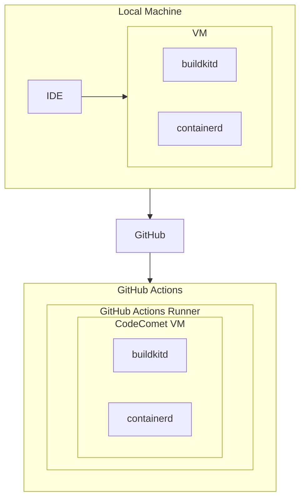

# Introduction

This page is for folks that are new to CodeComet. It will give you a high-level overview of our CI solution. If you'd rather skip this part, our [Quickstart guide](https://docs.codecomet.io/quickstart) will get you up and running faster.

## What is CodeComet?

_**CodeComet is a new CI system that replaces or runs within your existing CI (like GitHub Actions).**_

It is designed with usability, speed, and observability in mind. The key benefits of CodeComet are:

- **Runs anywhere**: Execute your CI pipelines on your local machine, within your existing CI system, on dedicated infrastructure, or more generally wherever containers run.
- **Pipelines as code**: Pipelines are no longer defined using YAML, or yet another DSL like Groovy. Instead, pipelines are expressed in your language of choice.
- **Intelligent caching**: A lot of CI time is spent re-running previously executed actions. CodeComet intelligently and aggressively caches prior executions to accelerate your Pipelines.
- **First-class Observability**: CI failures are hard to debug. CodeComet addresses this pain by providing in-depth analytics for current and previous Pipeline executions.

## Who is it for?

- **Modern software teams**: If your team has already embraced modern software practices, and uses a CI system like GitHub Actions or CircleCI, CodeComet is an easily-adoptable enhancement for your developers. It will help accelerate their pipelines, and make them easier to debug.
- **Data-driven engineering leaders**: If you are frustrated by the frequency of failures in your CI, or the lack of visibility into resource utilization, CodeComet is a good option to monitor and visualize pipeline executions across your entire organization (and down to the granular level of individual actions).
- **Over-burdened DevOps teams**: If your DevOps team is spread too thin supporting build and test tooling across the organization, CodeComet enables development teams to take more control and manage their own pipelines.

## How is it better?

Current CI systems are starting to show their age. Built before the container and orchestration revolutions, they are unable to keep up with the demands of modern software development organizations. Specifically, CodeComet is designed to:
- **Eliminate "Works on my machine"**: As software products and teams grow and mature, the problem of inconsistent behavior becomes much more pronounced. This manifests in CI systems, where pipelines become brittle and fail frequently. By ensuring an identical environment no matter where the CI runs, including on a developer's local machine, we eliminate these types of issues.
- **Accelerate Pipelines**: With a specific focus on speed, CodeComet is built from the ground up to intelligently and aggressively cache actions within a Pipeline that have been previously executed. It does this in a deterministic manner so that only valid cached results are utilized. The end result is potentially significant savings of developer time waiting for the CI to finish running.
- **Develop in familiar languages**: Current CI systems are inaccessible to the average developer. The need for specialized knowledge like YAML and Domain Specific Languages keep developers from taking ownership of their Pipelines. CodeComet enables developers to design Pipelines in familiar languages. Starting with our Go SDK, CodeComet brings pipeline design, maintenance and management closer to those most familiar with the project.
- **Provide insights into Pipeline performance**: Existing CI systems tack on Pipeline monitoring, logging and dashboarding as an afterthought. Observability has modernized the management of production systems, but these techniques need to be adopted earlier in the software development lifecycle. CodeComet offers detailed feedback on individual Pipeline execution, down to specific actions. This makes debugging and optimizing Pipelines much more practical.

## What's under the hood?

_[Mr. Space Raccoon to decide whether this section exists, and what to put in it.]_

CodeComet is architected on top of open-source projects `buildkit` and `containerd`.

`buildkit` unlocks a number of key benefits for software teams, notably efficient caching of instructions, distributable workers and easy import and export of build caches.

`containerd` powers the management of the entire container lifecycle, and is the underlying technology that guarantees consistency of pipeline execution.

### System Block Diagram (placeholder)
