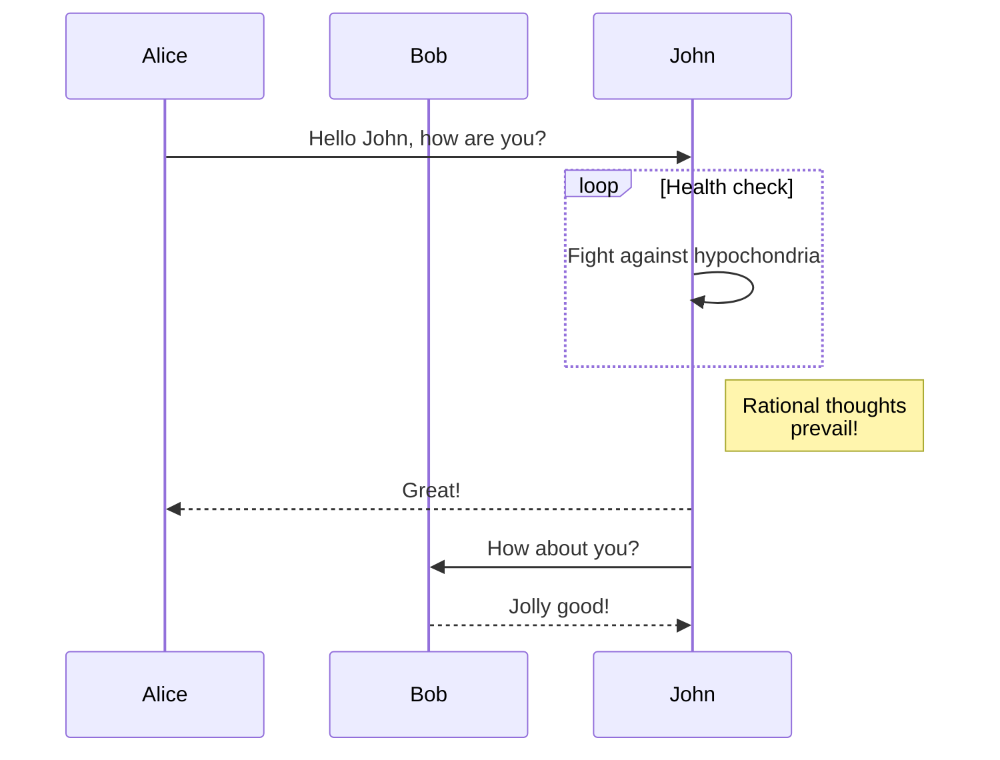

# Introduction

Let's get you up to speed on CodeComet in 5 minutes or less.

## What is CodeComet?

_**CodeComet is a new CI system that replaces or runs within your existing CI (like GitHub Actions).**_

It is designed with usability, speed, and observability in mind. The key benefits of CodeComet are:

- **Runs anywhere**: Execute your CI pipelines locally, within your existing CI system, on dedicated infrastructure, or at your favorite container store. :grin:
- **Pipelines as code**: No more YAML hell or DSLs like Groovy. Express pipelines in your language of choice.
- **Intelligent caching**: A lot of CI time is spent re-running previously executed actions. CodeComet aggressively caches prior executions to accelerate your pipelines.
- **First-class Observability**: Nobody enjoys debugging CI failures. CodeComet alleviates this pain by providing in-depth analytics for current and past pipeline runs.

If you're already sold on it :wink:, you can jump straight into our **[Quickstart](https://docs.codecomet.io/quickstart)** guide.

## Who is it for?

- **Modern software teams**: If your team has already embraced modern software practices, and uses a CI system like GitHub Actions or CircleCI, CodeComet is an easily-adoptable enhancement for your teams to accelerate their pipelines and make them more robust.
- **Data-driven executives**: If you're frustrated by the frequency of failures in your CI, or the lack of visibility into resource utilization, CodeComet is a good option to monitor and visualize pipeline executions across your entire organization (and down to the granular level of individual actions).
- **Over-burdened DevOps teams**: If your DevOps team is spread too thin supporting build and test tooling across the organization, CodeComet assists by empowering development teams to better manage their own pipelines.

## How is it better?

Current CI systems are starting to show their age. Built before the container revolution, they are unable to keep up with the demands of modern software teams. Specifically, existing CI systems lead to issues like:
- **Eliminates "works on my machine"**: If you've been a developer long enough, this phrase feels all too familiar. :grin: As software products and teams grow, the problem of _works here...but not here_ becomes much more pronounced. This manifests all too frequently in CI systems, where pipelines become brittle and tend to break for reasons that are hard to decipher. By ensuring an identical environment no matter where the CI executes the pipelines, including on a local developer's machine, we eliminate these types of issues.
- **Accelerates pipelines**: With a specific focus on speed, CodeComet is built from the ground up to aggressively cache actions within a pipeline that have been previously executed. It does this in a deterministic manner so that cached results are only utilized if the context of an action has not changed. The end result is saving of compute resources and more importantly developer time when the CI runs.
- **Develop in familiar languages**: Part of the challenge with current CI systems is their inaccessibility to the average developer. The need for specialized knowledge like YAML and Domain Specific Languages keep developers from taking ownership of their pipelines. To counter this, CodeComet enables developers to design pipelines in familiar languages. Starting with our Go SDK, and with SDKs for all major languages in the works, CodeComet brings pipeline design, maintenance and management closer to the project owners.
- **Granular insights into pipeline performance**: Existing CI systems tack on monitoring, logging and dashboarding of pipelines as an afterthought. Modern, complex software projects make pipelines brittle and hard to manage and debug. Observability has modernized the management of production systems, but the benefits of these techniques haven't been transferred to the build and test phase. CodeComet offers detailed feedback on how individual pipelines execute, down to specific actions. This makes debugging and optimizing pipelines that much more practical.

## What's under the hood?

CodeComet is architected on top of open-source projects `buildkit` and `containerd`.

`buildkit` unlocks a number of key benefits for software teams, notably efficient caching of instructions, distributable workers and easy import and export of build caches.

`containerd` powers the management of the entire container lifecycle, and is the underlying technology that enables guaranteed consistency of pipeline execution.

