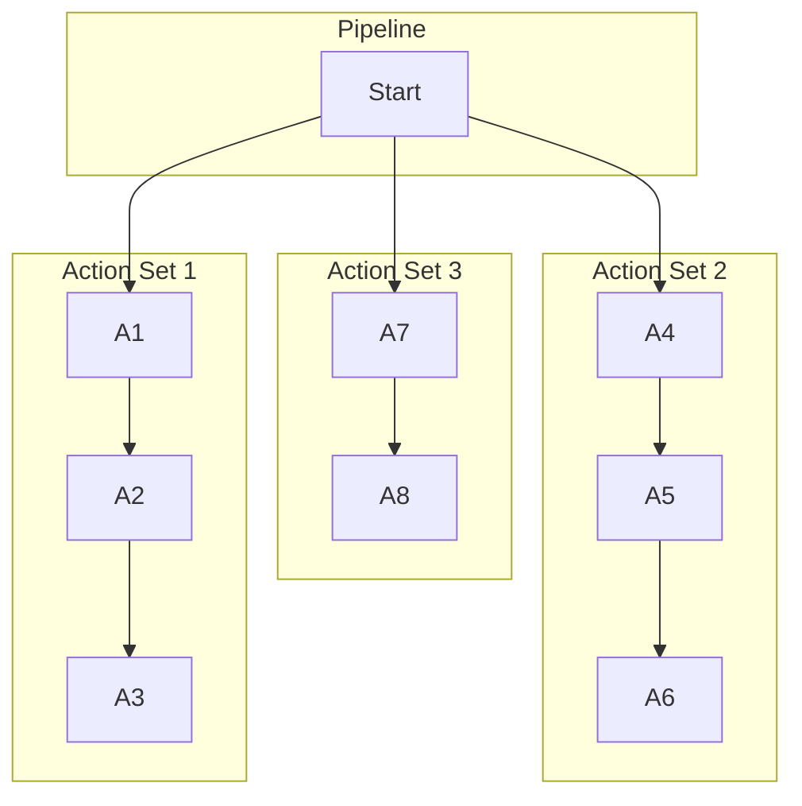

# Pipeline

In its most general form, a Pipeline is a collection of predetermined instructions that are executed to accomplish a specific goal relating to building and/or testing an application.

GitHub Actions calls them **Workflows**, CircleCI calls them **Pipelines** and Jenkins refers to them as **Declarative Pipelines**.

More specifically, a Pipeline is made up of Actions that run within one or more specified ExecutionContexts. By default, Pipelines execute Actions in parallel, but they can be specified to run sequentially.

Example Pipeline made up of multiple Actions:
