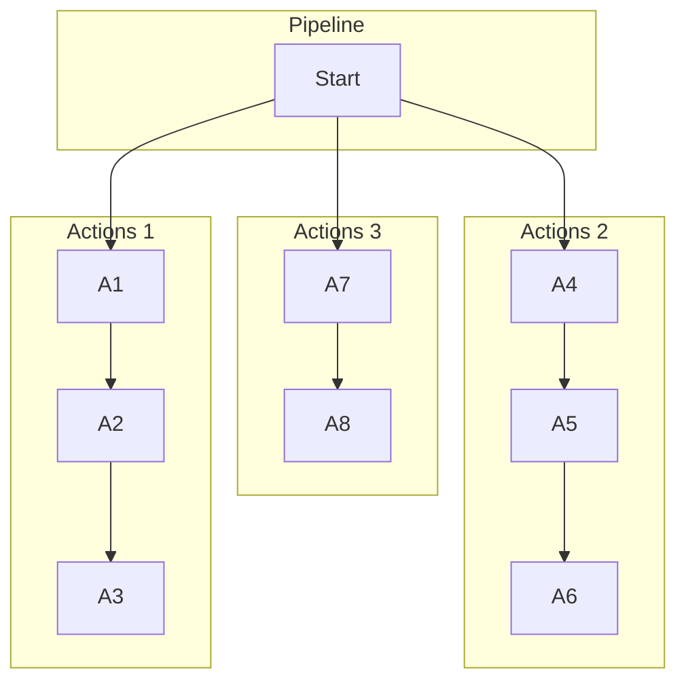

# What is a Pipeline?

If you're familiar with CI systems, CodeComet's Pipeline is likely what you think it is.

In its most general form, a Pipeline is a collection of instructions that are executed in a predetermined manner to accomplish a specific goal like building an application or validating it against a set of tests.

GitHub Actions calls them **Workflows**, CircleCI calls them **Pipelines** and Jenkins refers to them as **Declarative Pipelines**.

More specifically, a Pipeline is made up of Actions that run within one or more specified ExecutionContexts. By default, Pipelines execute Actions in parallel, but they can be specified to run sequentially.

Example Pipeline made up of multiple Actions:
