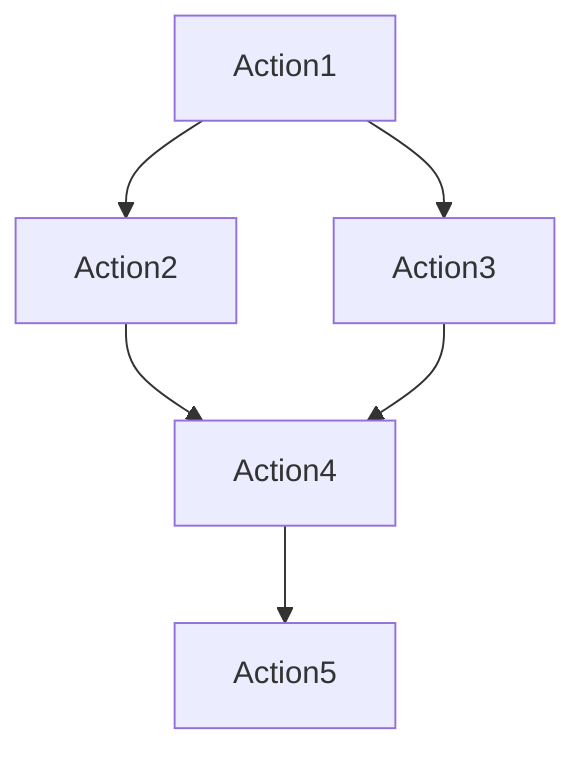

# What is an Action?

In CodeComet, an Action is a generic representation of a single instruction, or a set of instructions, to accomplish a specific task.

Actions can be as simple as a `bash` command to move files, or they can be as elaborate as a matrix of code compilation commands across multiple environments.

A predetermined set of Actions collectively form a Pipeline. Actions within a Pipeline run in parallel by default, but can be specified to run sequentially.

Actions can be envisioned as the atomic tasks whose inputs and outputs are connected to each other through a dependency graph.

Example dependency graph of Actions:
